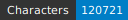
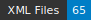

# HTRogène - Spain

<table border="0" width="100%" style="width: 100%; border:0;">
  <tr>
    <td align="left"></td>
    <td align="right"></td>
  </tr>
</table>

   

## Introduction

HTRogène is an exploratory project funded by Biblissima+, aiming to develop generic models for automatic transcription of medieval and early modern manuscripts.  
This repository focuses on the Medieval Italian corpus, providing ground-truth data for Handwritten Text Recognition (HTR) and layout segmentation.  
The dataset is designed to support the creation of robust and reliable HTR models for Italian manuscripts.

| Shelfmark            | Links                                             | Type   |   Century | Color Pages   |   Main Zones |   Lines |   Characters | Genre       |
|----------------------|---------------------------------------------------|--------|-----------|---------------|--------------|---------|--------------|-------------|
| Paris, BnF, esp. 33  | [**B**](https://data.biblissima.fr/entity/Q44326) | prose  |        14 | ✗             |           22 |     489 |        14303 | Treatises   |
| Paris, BnF, esp. 43  | [**B**](https://data.biblissima.fr/entity/Q44382) | verse  |        14 | ✗             |            8 |     284 |        18885 | Treatises   |
| Paris, BnF, esp. 286 | [**B**](https://data.biblissima.fr/entity/Q44294) | prose  |        15 | ✗             |            8 |     178 |         7462 | Treatises   |
| Paris, BnF, esp. 305 | [**B**](https://data.biblissima.fr/entity/Q44303) | mixed  |        15 | ✗             |           12 |     300 |         9648 | Poetry      |
| Paris, BnF, esp. 458 | [**B**](https://data.biblissima.fr/entity/Q44390) | prose  |        15 | ✗             |            8 |     331 |        22759 | Treatises   |
| Paris, BnF, esp. 161 | [**B**](https://data.biblissima.fr/entity/Q44219) | prose  |        16 | ✗             |           19 |     470 |        19399 | Espistolary |
| Paris, BnF, esp. 325 | [**B**](https://data.biblissima.fr/entity/Q44318) | prose  |        16 | ✗             |            9 |     281 |        15844 | Espistolary |
| Paris, BnF, esp. 37  | [**B**](https://data.biblissima.fr/entity/Q44350) | verse  |        16 | ✗             |           15 |     547 |        12421 | Poetry      |

## Dataset Overview

The dataset comprises carefully selected manuscripts, each containing approximately 10 columns of text (equivalent to 5 bi-column pages or 10 single-column pages).  
The data adheres to the Segmonto guidelines, ensuring consistency and compatibility with other datasets following the same standards.  
Each image is accompanied by two XML files:

- Files suffixed with `.chocomufin.xml` are normalized for compliance with broader datasets.
- The other XML files contain repository-specific information.

We recommend using the normalized `.chocomufin.xml` files for most applications.

### Total number of pages

65

### Regions

- MainZone (101)
- DigitizationArtefactZone (28)
- NumberingZone (31)
- MarginTextZone (27)
- StampZone (1)
- RunningTitleZone (3)
- GraphicZone (2)
- DropCapitalZone (6)

### Lines

- HeadingLine (68)
- DefaultLine (2808)
- InterlinearLine (4)

## Funding and Support

This project is funded by Biblissima+, an observatory for medieval and Renaissance written cultural heritage.  
Biblissima+ focuses on the study of the circulation of books and the transmission of texts from the 8th to 18th centuries.  
Learn more at the [Biblissima+ project page](https://projet.biblissima.fr/fr/appels-projets/projets-retenus/htrogene).

## License

This dataset is licensed under the Creative Commons Attribution 4.0 International License (CC BY 4.0).  
You are free to share and adapt the material, provided appropriate credit is given.

## Citation

If you use this dataset in your research, please cite it as follows:

> Hermand, F., Brootcorne, M., Vlachou-Efstathiou, M., Boschetti, F., Fischer, F., Chagué, A., & Clérice, T. HTRogène, Spanish corpus of ground-truth for Handwritten Text Recognition and Layout Segmentation [Data set]. https://github.com/HTRogene/spain

## Acknowledgments

We extend our gratitude to the transcribers and supervisors who contributed to the creation of this dataset.  

Special thanks to Biblissima+ for their financial support and commitment to advancing the study of medieval manuscripts.

For more information about the HTRogène project and other related resources, please visit the [Biblissima+ project page](https://projet.biblissima.fr/fr/appels-projets/projets-retenus/htrogene).
